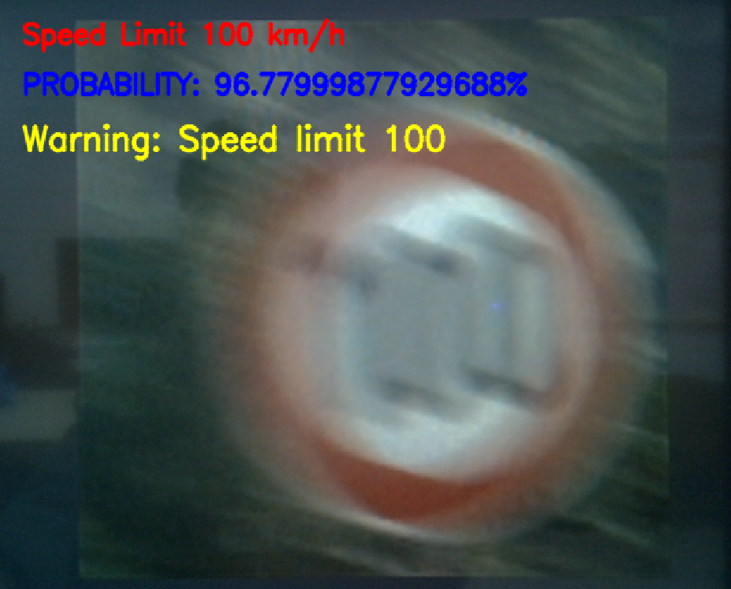
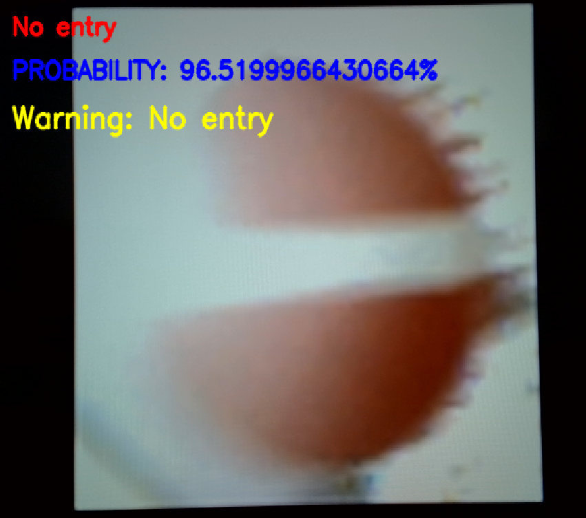
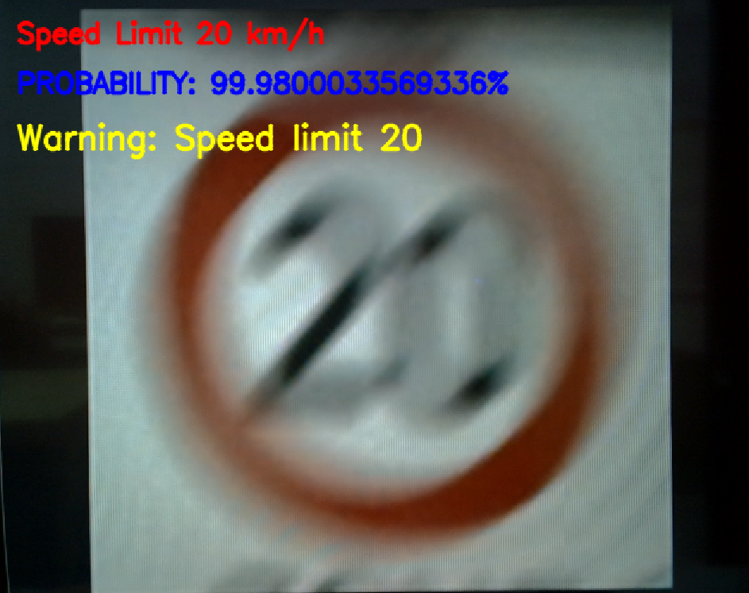
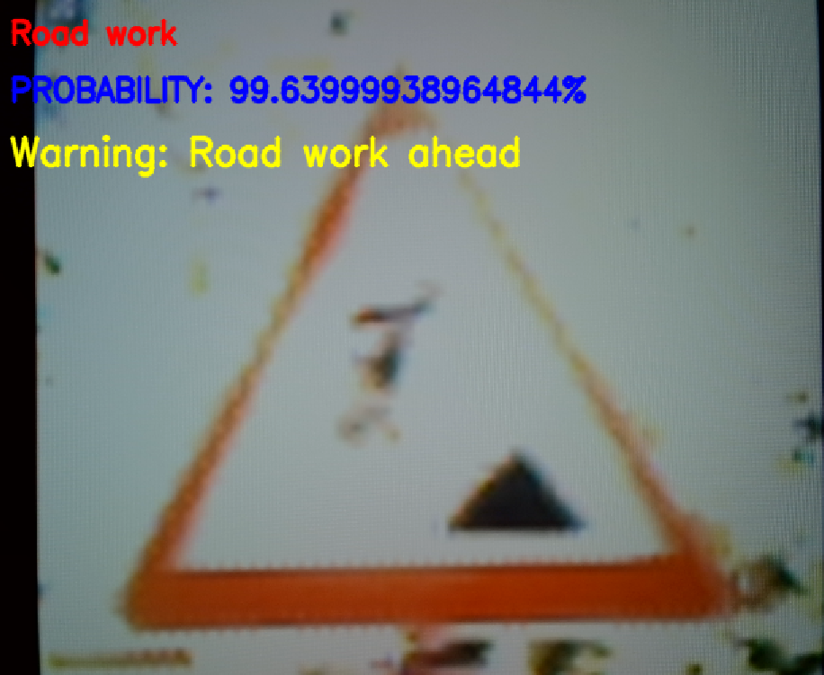

# Resilient Edge-Accelerated Traffic Sign Intelligence (RE-ATSI)

[](https://www.xilinx.com/)
[](https://www.xilinx.com/)
[]()

**RE-ATSI** is an end-to-end, edge-accelerated traffic sign recognition framework deployed on the **AMD Xilinx PYNQ-ZU (Zynq UltraScale+ MPSoC)** platform. By leveraging strategic hardware/software (HW/SW) co-design and physics-based data augmentation, the system delivers high accuracy, ultra-low power consumption, and real-time inference under adverse weather and degraded visual conditions.


## 🎬 Video Demonstration

Click the image below to watch the full system demonstration across adverse weather conditions (Heavy Rain, Night, Heavy Fog, and Sunny Highway):

[](https://www.youtube.com/watch?v=XQafspSWWTI)

> 💡 *Live demo testing real-time traffic sign detection and warning capabilities under complex edge driving scenarios.*
---

## 🚀 Key Highlights & Performance

* **Strategic HW/SW Co-Design**:
  * **Processing System (PS)**: Quad-core ARM Cortex-A53 handles camera I/O, control logic, FC layers, and alert dispatching.
  * **Programmable Logic (PL)**: Custom FPGA accelerator offloads computationally intensive convolution and pooling operations via AXI-Stream and DMA interfaces.
* **Low-Latency & High Energy Efficiency**:
  * **Inference Latency**: Reduced from **0.80s to 0.25s per frame** (**220% speedup**).
  * **Power Dissipation**: Operating power capped at **3.5W** (**82.5% power reduction** compared to conventional GPU/edge platforms).
  * **Memory Optimization**: Employs tile-based buffering (Line Buffers & Window Buffers) to relieve DDR bandwidth bottlenecks by **75%**.
* **Adverse Weather Robustness**:
  * Trained with synthetic adverse weather augmentation (lens refraction, fog degradation, motion blur, and glare).
  * Achieves **99.6% classification accuracy** across 40 traffic sign categories under real-world stress conditions.
* **Ultra-Lightweight Footprint**:
  * Pruned and quantized to **91,979 parameters (~359 KB)**, consuming minimal on-chip BRAM and DSP resources.

---

## 📊 Performance Comparison

| Metric | Before Optimization | After FPGA Acceleration | Improvement |
| :--- | :---: | :---: | :---: |
| **Inference Time** | 0.80 s | **0.25 s** | **220% Speedup** |
| **Power Consumption** | 20.0 W | **3.5 W** | **82.5% Energy Saving** |
| **Throughput** | 1-way pipeline | **4-way synchronized** | **400% Throughput** |
| **Memory Bandwidth** | 8 GB/s | **2 GB/s** | **75% Resource Reduction** |

### Environmental Robustness Benchmarks

| Environmental Condition | Baseline Accuracy | RE-ATSI Accuracy | Improvement |
| :--- | :---: | :---: | :---: |
| **Clear Day** | 97.0% | **99.6%** | +2.6% |
| **Rain & Water Droplets** | 96.0% | **99.6%** | +3.6% |
| **Heavy Fog / Haze** | 80.0% | **97.4%** | +17.4% |
| **Nighttime / Low-Light** | 80.0% | **98.2%** | +18.2% |
| **Strong Glare / Backlight** | 80.0% | **94.5%** | +14.5% |
| **Motion Blur** | 65.0% | **95.0%** | +30.0% |

---


## 🖼️ Showcase & Detection Results

| Speed Limit 100 km/h | No Entry |
| :---: | :---: |
|  |  |
| **Speed Limit 20 km/h** | **Road Work Ahead** |
|  |  |

---

## 🛠️ Hardware & Software Stack

* **Target Device**: AMD Xilinx PYNQ-ZU (Zynq UltraScale+ XCZU5EV)
* **EDA & Toolchains**: AMD Vitis HLS, Vivado Design Suite, PYNQ Linux Framework
* **Core Libraries**: PyTorch (Quantization/Pruning), OpenCV, NumPy
* **Communication Protocol**: AXI4-Stream, AXI-Lite, Direct Memory Access (DMA)

---

## 📁 Repository Structure

```text
edge-traffic-sign-system/
├── assets/                  # Architecture diagrams, test images, and snapshots
├── hls/                     # Vitis HLS source code and pragmas for Conv/Pool IP
├── overlay/                 # Vivado bitstream (.bit) and hardware handoff (.hwh)
├── notebooks/               # Jupyter notebooks for runtime inference and testing
├── .gitignore               # Excludes large checkpoints (.dcp) and archive datasets
└── README.md